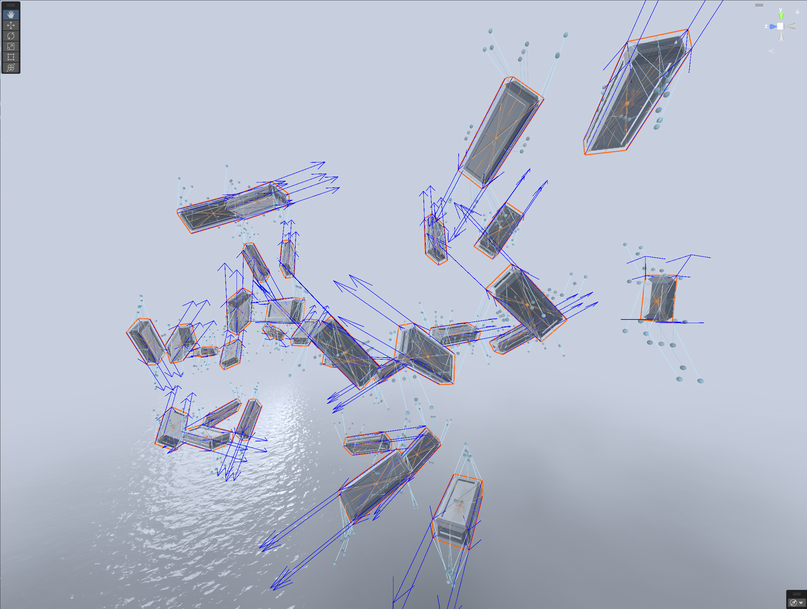
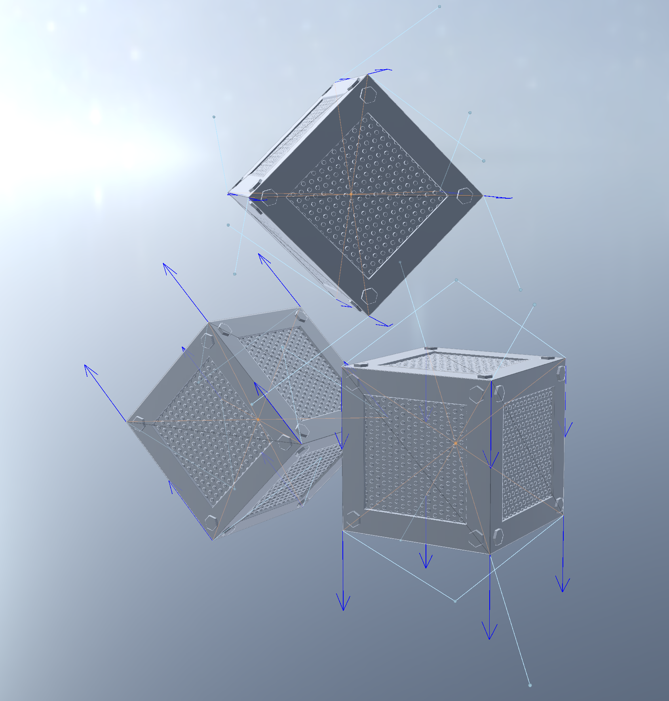
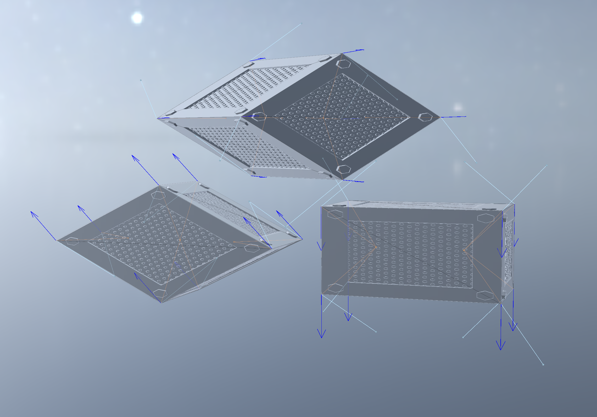
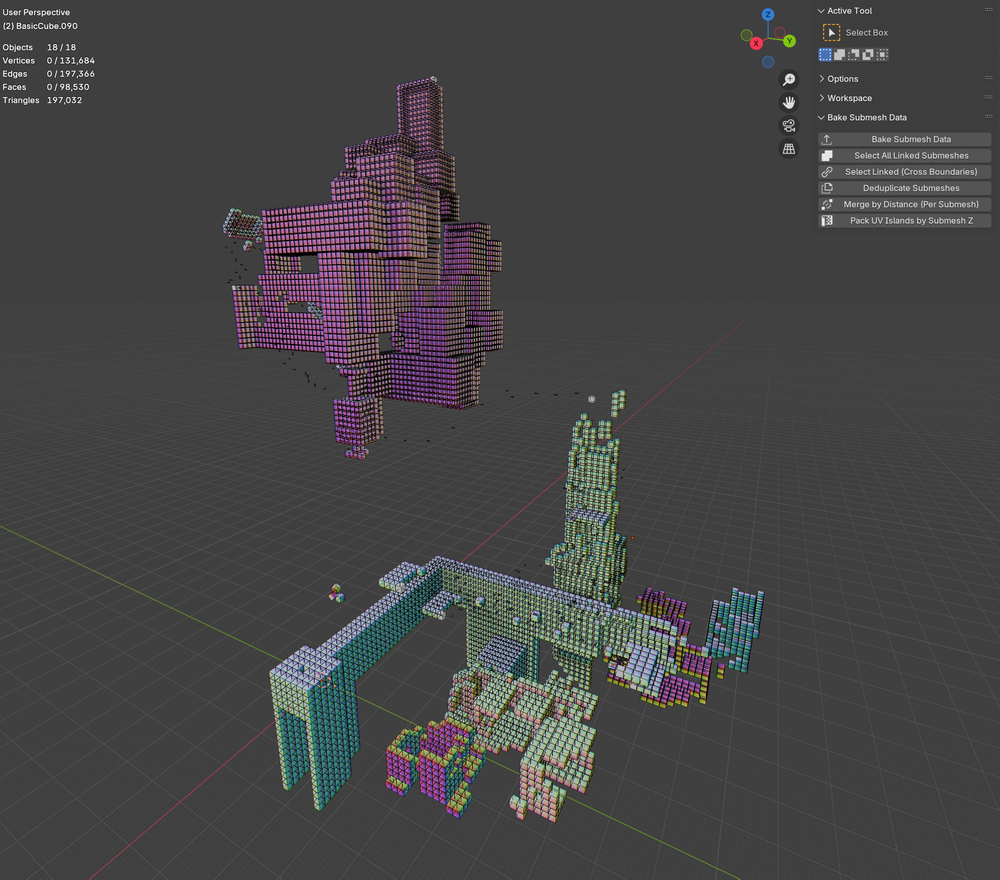
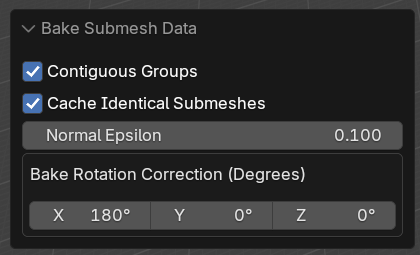

# 6 wave dispersion relations with derivatives
21 Sep 2025

Tessendorf's 2005 paper
"[Simulating Ocean Water](https://people.computing.clemson.edu/~jtessen/reports/papers_files/coursenotes2004.pdf)"
describes three basic dispersion relations:

1. The deep water dispersion relation:

    $$
    \omega^2 = gk
    $$

    where $\omega$ is the wave's temporal frequency in $\text{rad}/s$, $g$ is gravity
    in $m/s^2$, and $k$ is the spatial frequency in $m/s$.

2. The shallow water dispersion relation:

    $$
    \omega^2 = gk \tanh kh
    $$

    where $h$ is the water mean depth in $m$.

3. The deep water relation with viscosity correction:

    $$
    \omega^2 = gk (1 + k^2 L^2)
    $$

    where $L$ is the scale in $m$ at which the viscosity term operates. At 0,
    it has no effect.

Horvath's 2015 paper
"[Empirical directional wave spectra for computer graphics](https://dl.acm.org/doi/10.1145/2791261.2791267)"
formulates the viscosity term in terms of different physical units, and applies
it to the shallow water dispersion relation:

$$
\omega^2 = (gk + \frac{\sigma}{\rho} k^3) \tanh kh
$$

where $\sigma$ is the surface tension in $N/m$, and $\rho$ is the water density
in $kg/m^3$.

It is useful to have derivatives of the dispersion relation. Horvath's paper
describes how we can calculate the spectrum term $S(k_x, k_y)$ from
$S(\omega, \theta)$ and the derivative of the dispersion relation
$\frac{\partial \omega}{\partial k}$:

$$
S(k_x, k_y) = S(\omega, \theta) \frac{\partial \omega}{\partial k} / k
$$

So, with that motivation, we would like the derivatives of our dispersion
relations. You should autodifferentiate if that's an option. If not, here are
derivations of each derivative:


1. Deep water:

    $$
    \begin{align*}
    \omega^2 &= gk \\
    \omega &= (gk)^\frac{1}{2} \\
    \frac{\partial \omega}{\partial k} &= \frac{1}{2} (gk)^{-\frac{1}{2}} g \\
    &= \frac{g}{2\sqrt{gk}} \\
    &= \frac{1}{2} \sqrt{\frac{g}{k}}
    \end{align*}
    $$

    Wolfram [here](https://www.wolframalpha.com/input?i=d%2Fdk+%28%28gk%29%5E%281%2F2%29%29).

2. Shallow water:

    First we will need $\frac{\partial}{\partial k} \tanh kh$:

    $$
    \begin{align*}
    \frac{\partial}{\partial k} \tanh kh
    &= \frac{\partial}{\partial k} [\frac{e^{kh} - e^{-kh}}{e^{kh}+e^{-kh}}] \\
    &= \frac{\partial}{\partial k} [(e^{kh} - e^{-kh})(e^{kh}+e^{-kh})^{-1}] \\
    &= (he^{kh}-he^{-kh})(e^{kh}+e^{-kh})^{-1} +
            (e^{kh}-e^{-kh})[-(e^{kh}+e^{-kh})^{-2}(he^{kh}-he^{-kh})] \\
    &= h(1-[\frac{e^{kh}-e^{-kh}}{e^{kh}+e^{-kh}}]^2 \\
    &= h(1-\tanh^2 kh)
    \end{align*}
    $$

    With that identity, let's proceed:

    $$
    \begin{align*}
    \omega^2 &= gk \tanh kh \\
    \omega &= (gk \tanh kh)^{\frac{1}{2}} \\
    \frac{\partial \omega}{\partial k} &= \frac{1}{2} [gk \tanh kh]^{-\frac{1}{2}} [g \tanh (kh) + gkh(1 - \tanh ^2 kh] \\
    &= \frac{g(\tanh kh + kh(1 - \tanh ^2 kh))}{2 \sqrt{gk \tanh kh}} \\
    &= \frac{g \tanh kh + gkh (1 - \tanh^2 kh)}{2 \sqrt{gk \tanh kh}} \\
    &= \frac{1}{2} [\sqrt{g \tanh kh} + \frac {gkh(1 - \tanh^2 kh)}{\sqrt{gk \tanh kh}}] \\
    &= \frac {g \tanh kh + gkh(1 - \tanh^2 kh)}{2\sqrt{gk \tanh kh}} \\
    &= \frac {g (\tanh kh + kh \operatorname{sech}^2 kh)}{2\sqrt{gk \tanh kh}}
    \end{align*}
    $$

    Wolfram [here](https://www.wolframalpha.com/input?i=d%2Fdk+%5Bsqrt%28gk+tanh+%28kh%29%29%5D).
    (Recall that $\operatorname{sech}^2 x = 1 - \tanh^2 x$.)

3. Viscous deep water (Tessendorf version):

    $$
    \begin{align*}
    \omega^2 &= gk [1 + k^2 L^2] \\
    \omega &= (gk [1 + k^2 L^2])^{\frac{1}{2}} \\
    \frac{\partial \omega}{\partial k} &= \frac{1}{2}(gk [1 + k^2 L^2])^{-\frac{1}{2}} [g+3gk^2 L^2] \\
    &= \frac{g+3gk^2L^2}{2\sqrt{gk[1+k^2L^2]}}
    \end{align*}
    $$

    Wolfram [here](https://www.wolframalpha.com/input?i=d%2Fdk+%5B%28gk+%281+%2B+%28k%5E2%29+%28L%5E2%29%29%29+%5E+%281%2F2%29%5D).

4. Viscous deep water (Horvath version):

    $$
    \begin{align*}
    \omega^2 &= gk + \frac{\sigma}{\rho}k^3 \\
    \omega &= (gk + \frac{\sigma}{\rho}k^3)^{\frac{1}{2}} \\
    \frac{\partial \omega}{\partial k} &=
            \frac{1}{2}(gk + \frac{\sigma}{\rho}k^3)^{-\frac{1}{2}} [g+3\frac{\sigma}{\rho}k^2] \\
    &= \frac{g + 3 \frac{\sigma}{\rho}k^2}{2 \sqrt{gk+\frac{\sigma}{\rho}k^3}}
    \end{align*}
    $$

    Wolfram [here](https://www.wolframalpha.com/input?i=d%2Fdk+%5B%28gk%2Bs%28k%5E3%29%2Fp%29%5E%281%2F2%29%5D).

5. Viscous shallow water (Tessendorf version):

    FYI - use the Horvath version instead. This relation sucks.

    We'll want $\frac{\partial}{\partial k} \sqrt{\tanh kh}$:

    $$
    \begin{align*}
    \frac{\partial}{\partial k} \sqrt{\tanh kh}
    &= \frac{\partial}{\partial k} (\tanh kh)^{\frac{1}{2}} \\
    &= \frac{1}{2} (\tanh kh)^{-\frac{1}{2}} \frac{\partial}{\partial k} \tanh kh \\
    &= \frac{1}{2} (\tanh kh)^{-\frac{1}{2}} h(1 - \tanh^2 kh) \\
    &= h \frac{1 - \tanh^2 kh}{2 \sqrt{\tanh kh}} \\
    &= h \frac{\operatorname{sech}^2 kh}{2 \sqrt{\tanh kh}}
    \end{align*}
    $$

    Now we can proceed:

    $$
    \begin{align*}
    \omega^2 &= gk (1 + k^2 L^2) \tanh kh \\
    \omega &= (gk (1 + k^2 L^2) \tanh kh)^{\frac{1}{2}} \\
    \frac{\partial \omega}{\partial k}
    &= (\frac{\partial}{\partial k} [gk (1 + k^2 L^2)]) \tanh kh +
        [gk (1 + k^2 L^2)] \frac{\partial}{\partial k} \tanh kh \\
    &= \frac{g (3 + k^2 L^2)}{2 \sqrt{k} \sqrt{g (1 + k^2 L^2)}} \dots \\
    &= \frac{1}{2} \sqrt{\frac{g(3+k^2 L^2)}{k}} \sqrt{\tanh kh} +
            \sqrt{gk (1+k^2 L^2)} [\frac{h (1 - \tanh^2 kh)}{2 \sqrt{\tanh kh}}]
    \end{align*}
    $$

    We can apply some transformations to get a common denominator and agree
    with Wolfram:

    $$
    \begin{align*}
    \frac{\partial \omega}{\partial k}
    &= \frac{g (3 + k^2 L^2)}{2 \sqrt{gk(1+k^2 L^2)}} \sqrt{\tanh kh} + \dots \\
    &= \frac{g (3 + k^2 L^2) \tanh kh}{2 \sqrt{gk(1+k^2 L^2) \tanh kh}} + \dots \\
    &= \dots + \sqrt{gk (1+k^2 L^2)} [\frac{h (1 - \tanh^2 kh)}{2 \sqrt{\tanh kh}}] \\
    &= \dots + \frac{gk(1+k^2 L^2)}{\sqrt{gk(1+k^2 L^2)}} [\frac{h (1 - \tanh^2 kh)}{2 \sqrt{\tanh kh}}] \\
    &= \dots + \frac{gk(1+k^2 L^2) h (1 - \tanh^2 kh)}{2 \sqrt{gk(1+k^2 L^2) \tanh kh}} \\
    &= \dots + \frac{ghk(1+k^2 L^2)(1-\tanh^2 kh)}{2 \sqrt{gk(1+k^2 L^2) \tanh kh}} \\
    &= \frac{g(3+k^2L^2) \tanh kh + ghk(1+k^2 L^2)(1-\tanh^2 kh)}{2 \sqrt{gk(1+k^2 L^2) \tanh kh}} \\
    &= \frac{g(3+k^2L^2) \tanh kh + ghk(1+k^2 L^2)(\operatorname{sech}^2 kh)}{2 \sqrt{gk(1+k^2 L^2) \tanh kh}}
    \end{align*}
    $$

    Wolfram [here](https://www.wolframalpha.com/input?i=d%2Fdk+%5Bsqrt%28gk+%281+%2B+%28k%5E2%29%28L%5E2%29%29+tanh+%28kh%29%29%5D).

6. Viscous shallow water (Horvath version):

    $$
    \begin{align*}
    \omega^2 &= (gk + \frac{\sigma}{\rho}k^3) \tanh kh \\
    \omega &= ((gk + \frac{\sigma}{\rho}k^3) \tanh kh)^{\frac{1}{2}} \\
    \frac{\partial \omega}{\partial k}
    &= [\frac{\partial}{\partial k}(gk + \frac{\sigma}{\rho}k^3)] \tanh^{\frac{1}{2}} kh +
        (gk + \frac{\sigma}{\rho}k^3)^{\frac{1}{2}} \frac{\partial}{\partial k} \tanh^{\frac{1}{2}} kh \\
    &= [\frac{1}{2}(gk+\frac{\sigma}{\rho}k^3)^{-\frac{1}{2}}(g+3\frac{\sigma}{\rho}k^2)] \tanh^{\frac{1}{2}} kh +
        (gk + \frac{\sigma}{\rho}k^3)^{\frac{1}{2}}h\frac{1-\tanh^2 kh}{2 \sqrt{\tanh kh}}
    \end{align*}
    $$

    Let's try to corral this into a form closer to what Wolfram gives us:

    $$
    \begin{align*}
    \frac{\partial \omega}{\partial k}
    &= [\frac{1}{2}(gk+\frac{\sigma}{\rho}k^3)^{-\frac{1}{2}}(g+3\frac{\sigma}{\rho}k^2)] \sqrt{\tanh{kh}} +
        (gk + \frac{\sigma}{\rho}k^3)^{\frac{1}{2}}h\frac{1-\tanh^2 kh}{2 \sqrt{\tanh kh}} \\
    &= \frac{g+3\frac{\sigma}{\rho}k^2}{2\sqrt{gk+\frac{\sigma}{\rho}k^3}} \sqrt{\tanh{kh}} + \dots \\
    &= \frac{(g+3\frac{\sigma}{\rho}k^2) \tanh{kh}}{2\sqrt{(gk+\frac{\sigma}{\rho}k^3)\tanh{kh}}} + \dots \\
    &= \dots + (gk + \frac{\sigma}{\rho}k^3)^{\frac{1}{2}}h\frac{1-\tanh^2 kh}{2 \sqrt{\tanh kh}} \\
    &= \dots + (gk + \frac{\sigma}{\rho}k^3)h\frac{1-\tanh^2 kh}{2 \sqrt{(gk + \frac{\sigma}{\rho}k^3) \tanh kh}} \\
    &= \dots + \frac{h (gk+\frac{\sigma}{\rho}k^3) (1 - \tanh^2 kh)}{2 \sqrt{(gk+\frac{\sigma}{\rho}k^3)\tanh kh}} \\
    &= \frac{(g+3\frac{\sigma}{\rho}k^2) \tanh{kh} + h (gk+\frac{\sigma}{\rho}k^3) (1 - \tanh^2 kh)}{2 \sqrt{(gk+\frac{\sigma}{\rho}k^3)\tanh kh}} \\
    &= \frac{(g+3\frac{\sigma}{\rho}k^2) \tanh{kh} + h (gk+\frac{\sigma}{\rho}k^3) \operatorname{sech}^2{kh}}{2 \sqrt{(gk+\frac{\sigma}{\rho}k^3)\tanh kh}}
    \end{align*}
    $$


    Wolfram [here](https://www.wolframalpha.com/input?i=d%2Fdk+%5B%28%28gk%2Bs%28k%5E3%29%2Fp%29tanh%28kh%29%29%5E%281%2F2%29%5D).
    Divide numerator and denominator by $\rho$ (or p in wolfram) to make them
    match.

# meow meow meow meow
10 Sep 2025

meow meow meow meow meow meow meow meow'meow meow meow meow meow. meow
meow meow meow.

## meow meow

* meow meow meow 3 meow meow 65 meow meow meow.
  * 3% meow meow meow meow meow meow meow 3 meow.
  * meow meow meow meow meow meow meow meow meow 65 meow.
* meow meow meow meow meow meow 1-10 meow meow meow.
  * meow meow meow meow meow'meow meow meow meow meow meow-meow meow meow meow meow
    meow meow meow meow. meow, meow meow meow meow meow meow meow.
* meow meow > 3 meow meow meow meow meow meow meow meow.
* meow meow meow meow meow 10 meow/meow^2 meow'meow meow. meow'meow meow
  meow meow meow meow meow.

## meow, meow: meow meow meow meow meow (2007)

[meow meow meow.](meow://meow.meow.meow.meow/meow/meow/meow/meow43-48-meow2007.meow)

meow

* meow 1993, meow meow meow meow meow meow meow meow meow meow.
* meow 1997, meow meow meow meow meow 560 meow meow. 76% meow meow meow
  meow meow. (meow'meow meow meow meow meow 1, meow 38)
* meow 2012, meow meow meow meow meow meow meow 30 meow meow.
* meow meow meow, meow meow meow 2, meow meow 2 meow meow
  meow meow meow meow.
* meow 1 meow 4,000 meow meow meow meow meow meow (meow).
  * meow meow meow meow 5% meow meow meow meow.

meow

* meow meow meow meow meow meow.
* meow meow meow meow meow meow meow meow meow meow.
* 25% meow meow meow meow meow meow meow meow 20meow meow 30meow.
* 25% meow meow meow meow meow meow meow. meow meow meow meow
  meow meow.

meow meow meow

* 79%: meow meow meow
* 10%: meow meow
* 6%: meow meow
* 5%: meow meow

meow meow

* meow meow meow meow meow meow (meow)
* meow meow meow meow meow meow meow meow meow
* meow meow meow 1362 meow meow meow meow
  * (meow: 1 meow/meow^2 meow meow meow 1 *meow*)
* meow meow meow meow 5 meow meow meow, 5 meow meow meow.
* meow meow meow 0-12 meow. meow meow meow.
* meow meow, meow meow meow meow meow meow meow meow meow 3 meow 65
  meow.
* 49% meow meow meow meow meow meow meow 50 meow, meow meow meow meow
  meow meow meow meow meow meow meow meow meow (meow meow meow
  meow).
* meow meow meow meow meow meow meow meow meow.
* 67% meow meow meow meow meow meow meow meow meow meow.
* meow

meow meow

* meow meow meow meow meow
* meow meow meow meow meow meow meow meow meow meow meow meow meow
* meow meow meow meow meow meow
* meow meow meow meow 1-10 meow meow meow
  * meow: meow 120 meow meow, meow meow meow meow meow meow 1200 meow meow 2400
    meow *meow*. meow!
* meow meow meow meow meow meow 10-20 meow meow meow meow.
* meow meow meow meow meow meow meow meow.

meow meow

* meow meow > 3 meow meow meow meow meow meow meow 25% meow meow meow meow
  meow.
  * meow meow meow meow meow meow meow meow meow 10 meow meow meow.
* meow meow meow meow meow meow 3 meow meow meow meow *meow*.

## meow, meow: meow meow meow meow meow meow meow
meow (2002)

[meow meow meow.](meow://meow.meow/2001-150.meow)

meow

* meow 1 meow 6000 meow meow meow meow meow
* meow meow meow meow meow 7 meow 20 meow meow
* (meow meow meow meow meow meow meow)
* meow meow meow meow meow meow meow meow meow meow meow meow meow meow meow
  meow meow meow meow meow meow, meow meow meow meow.

meow

* meow meow meow, meow meow-meow meow, meow meow meow meow meow
  meow meow
* meow meow meow meow meow meow meow meow meow meow meow meow meow
  meow meow meow meow meow meow 1 meow 50 meow. meow meow meow
  meow meow meow (meow meow meow meow meow - 0% = meow meow, 100% =
  meow meow meow meow) meow meow meow 50% (meow meow).
* meow meow meow. meow meow meow meow meow meow meow meow meow
  meow meow meow 10 meow/meow^2 meow 200 meow/meow^2. meow 10meow/meow^2, meow meow meow
  meow; meow 200 meow/meow^2, meow meow. "... meow meow meow meow meow meow
  meow meow meow meow meow meow meow meow meow meow meow."
* meow meow 5 meow/meow^2 meow meow meow meow meow meow meow meow.
  meow meow 20 meow/meow^2 meow meow meow meow meow meow meow 100 meow/meow^2.
  * meow: meow meow = meow meow meow.
* meow meow meow meow meow meow meow meow meow meow meow,
  meow 8.8% meow meow meow meow meow ~55% meow meow meow meow.

# rasterized ray marching at scale
11 Jun 2025

I've long had the dream of creating high resolution chains on characters with
raymarching. The problem is that Unity's object transform is based on the
character's hip bone, so making raymarched geometry "stick" to characters
is impossible.

The idea I've been toying with for a long time is to raymarch inside a
rasterized box. If you store information in that box's verts, you could do a
raymarch inside a wholly self contained coordinate system.
I've pulled this off, but not in a way which is useful for characters (yet).


{width=80%}

TLDR:

* Create a Blender plugin to bake the location and orientation of submeshes.
  Plugin available
  [here](https://github.com/yum-food/2ner/blob/master/Scripts/BakeVertexData.py).
* Create a Unity script to visualize the baked data. Script available
  [here](https://github.com/yum-food/2ner/blob/master/Scripts/Editor/DecodeVertexData.cs).
* Provide HLSL code showing how to use the baked data.

## Main ideas and HLSL

The core idea is to make it possible for each fragment of a material to learn
an origin point's location and orientation. If you can recover an origin point
and a rotation, then you can raymarch inside that coordinate system, then
translate back to object coordinates at the end.

For each submesh\* in a mesh, I bake an origin point and an orientation.

\* A submesh is just a set of vertices connected by edges. A mesh might contain
many unconnected submeshes. For example, in blender, you can combine two
objects with ctrl+J. I call those two combined but unconnected things
*submeshes*.

The orientation of the submesh is derived from the face normals. I sort the
faces in the submesh by their area. The largest area face is used as the first
basis vector of our rotated coordinate system. Then I get the next face which
is sufficiently orthogonal to the first basis vector (absolute value of dot
product is > some epsilon). I orthogonalize those two basis vectors with
[graham-schmidt](https://en.wikipedia.org/wiki/Gram%E2%80%93Schmidt_process),
then generate the third with a cross product. I ensure right-handedness by
checking that the determinant is positive, then [convert to a
quaternion](https://en.wikipedia.org/wiki/Rotation_matrix#Conversion_from_rotation_matrix_to_axis%E2%80%93angle).
I then store that quaternion in 2 UV channels.

The rotation quaternion is recovered on the GPU as follows:

```c
float4 GetRotation(v2f i, float2 uv_channels) {
  float4 quat;
  quat.xy = get_uv_by_channel(i, uv_channels.x);
  quat.zw = get_uv_by_channel(i, uv_channels.y);
  return quat;
}
...
RayMarcherOutput MyRayMarcher(v2f i) {
...
  float2 uv_channels = float2(1, 2);
  float4 quat = GetRotation(i, uv_channels);
  float4 iquat = float4(-quat.xyz, quat.w);
}
```

It's worth lingering here for a second. Each submesh is conceptualized as a
rotated bounding box. We just deduced an orthonormal basis for that rotated
coordinate system. That means that the artist can rotate their bounding boxes
however they want in Blender, and the plugin will automatically work out how to
orient things. You can arbitrarily move and rotate your bounding boxes and it
Just Works.

The origin point is simply the average of all the vertex locations. I encode it
as a vector from each vertex to that location, and stuff it into vertex colors.
Since vertex colors can only encode numbers in the range [0, 1], I use the
alpha channel to scale the length of each vertex.

I made two non obvious decisions in the way I bake the vertex offsets:

1. The offsets are encoded in terms of the rotated coordinate system. This saves
   one quaternion rotation in the shader.

2. The offsets are scaled according to the L-infinity norm (Manhattan distance)
   rather than the standard L2 norm (Euclidian distance). This lets the artist
   think in terms of the bounding box dimensions rather than the square root of
   the sum of squares of the box's dimensions. Like if your box is 1x0.6x0.2,
   then you can just raymarch a primitive with those dimensions and your

The origin point is recovered on the GPU as follows:

```c
float3 GetFragToOrigin(v2f i) {
  return (i.color * 2.0f - 1.0f) / i.color.a;
}
RayMarcherOutput MyRayMarcher(v2f i) {
...
  float3 frag_to_origin = GetFragToOrigin(i);
}
```

With those pieces in place, the raymarcher is pretty standard, but some care
has to be taken when getting into and out of the coordinate system. Here's a
complete example in HLSL:

```c
RayMarcherOutput MyRayMarcher(v2f i) {
  float3 obj_space_camera_pos = mul(unity_WorldToObject,
      float4(_WorldSpaceCameraPos, 1.0));
  float3 frag_to_origin = GetFragToOrigin(i);

  float2 uv_channels = float2(1, 2);
  float4 quat = GetRotation(i, uv_channels);
  float4 iquat = float4(-quat.xyz, quat.w);

  // ro is already expressed in terms of rotated basis vectors, so we
  // don't have to rotate it again.
  float3 ro = -frag_to_origin;
  float3 rd = normalize(i.objPos - obj_space_camera_pos);
  rd = rotate_vector(rd, iquat);

  float d;
  float d_acc = 0;
  const float epsilon = 1e-3f;
  const float max_d = 1;

  [loop]
  for (uint ii; ii < CUSTOM30_MAX_STEPS; ++ii) {
    float3 p = ro + rd * d_acc;
    d = map(p);
    d_acc += d;
    if (d < epsilon) break;
    if (d_acc > max_d) break;
  }
  clip(epsilon - d);

  float3 localHit = ro + rd * d_acc;
  float3 objHit = rotate_vector(localHit, quat);
  float3 objCenterOffset = rotate_vector(frag_to_origin, quat);

  RayMarcherOutput o;
  o.objPos = objHit + (i.objPos + objCenterOffset);
  float4 clipPos = UnityObjectToClipPos(o.objPos);
  o.depth = clipPos.z / clipPos.w;

  // Calculate normal in rotated space using standard raymarcher
  // gradient technique
  float3 sdfNormal = calc_normal(localHit);
  float3 objNormal = rotate_vector(sdfNormal, quat);
  o.normal = UnityObjectToWorldNormal(objNormal);

  return o;
}
```

## Scalability and limitations

1. This technique is extremely scalable. I have a world with 16,000 bounding boxes
that runs at ~800 microseconds/frame without volumetrics.

2. You can have overlapping raymarched geometry without paying the usual 8x
slowdown of [domain
repetition](https://iquilezles.org/articles/sdfrepetition/).

{width=80%}

You still pay the price of overdraw, and unlike domain repetition, there's no
built-in compute budgeting. I.e. with domain repetition you'd hit your
iteration cap and stop. With this you won't.

3. The workflow is artist friendly. You can move, scale, and rotate your
geometry freely. Re-bake once you're done and everything just works.

4. Shearing works, but doesn't permit re-baking.

{width=80%}

{width=80%}

{width=80%}

{width=80%}

## Blender and Unity tooling

I've written a Blender plugin to permit myself to bake the vectors and
quaternions as described above.

{width=80%}

The plugin supports baking vectors and quaternions on extremely large meshes
primarily through caching. If your mesh contains many submeshes that are
simply translated in space, then baking should take less than a second. If
those submeshes are scaled, skewed, or rotated, then they won't cache and
baking will take longer.

The baker lets you rotate the baked quaternion around the basis vectors. I had
to fuck with this a fair bit, and eventually found that 180 degrees worked. Try
going through every combo of 90 degrees (64 total) if you run into trouble. Use
[quick exporter](https://github.com/Wildergames/blender-quick-exporter) to
speed up the process. You can visualize the vectors with my Unity script, which
is described below.

{width=80%}

It also supports a bunch of other workflows, mostly designed for the voxel
world creation workflow:

1. Select all linked submeshes. This just does ctrl+L for each submesh with at
least one vert, edge, or face selected. Blender's built in ctrl+L seems to be
inconsistent in its behavior.

2. Select linked across boundaries. This basically does ctrl+L, but lets the
meshes be disconnected at as long as they have a vert that's within some
epsilon of a selected vert. That epsilon is configurable. It's scalable
up to thousands of submeshes.

3. Deduplicate submeshes. This just looks for submeshes where all their verts
are close to others. The closeness parameter (epsilon) is configurable. It
works via spatial hashing so it's extremely scalable.

4. Merge by distance per submesh. This just iterates over all submeshes and
does a merge by distance on each. When working with large collections of
submeshes, it's easy to accidentally duplicate a face/edge/vert along the way,
and these duplications can stack up. This lets you recover.

5. Pack UV island by submesh Z. This lets you pack UV islands for large
collections of submeshes and sort them by their Blender z axis height. Buggy as
shit rn, sorry!

This is less relevant, but I wanted some way to instance axis-aligned geometry
along a curve and sort each instance's UVs by Z height. These nodes do that.
Put them on a curve and select your instance. Then use the "Pack UV island by
submesh Z" plugin tool to actually pack them.

{width=80%}

Finally, I have a Unity script which lets you visualize the raw baked vectors,
and the "corrected" baked vectors, i.e. those rotated with the baked
quaternion. Simply attach "Decode vertex vectors" to your gameobject. The light
blue vectors are raw vectors, and the orange ones are the corrected ones. The
orange ones should converge at the center of each submesh.
(It's okay if they overshoot/undershoot, you
can correct for that in your SDF.)

{width=80%}

# how much CO2 do American cars produce?
23 May 2025

TLDR: About $1.520 \cdot 10^{12}$ kg/year. This increases the CO$_2$ in the
atmosphere by about $0.048$% per year.

Let's gather some facts:

* The average American (16 or older) drives about 13,476 miles per year
  ([US DoT](https://www.fhwa.dot.gov/ohim/onh00/bar8.htm)).
* There are 265,653,749 Americans aged 16 or older
  ([US 2020 Census](https://www2.census.gov/programs-surveys/popest/tables/2020-2023/national/asrh/nc-est2023-agesex.xlsx)).
* Finished motor gasoline releases about 18.73 pounds of CO$_2$ per gallon
  ([US Energy Information Administration](https://www.eia.gov/environment/emissions/co2_vol_mass.php)).
* New light duty vehicles (those weighing 10,000 pounds or less) get about 26.0
  miles per gallon (mpg) as of 2024
  ([US DoE](https://www.energy.gov/eere/vehicles/articles/fotw-1330-february-19-2024-epa-data-show-average-fuel-economy-new-light-duty)).
* Freight trucks are much, much worse, at around 5-7 mpg.
  ([US DoE](https://afdc.energy.gov/data/10310))

Assume that the weighted average car is getting 20 mpg. This includes passenger
and freight. Passenger cars are higher and freight vehicles are lower.

Then:

$$
\begin{align*}
& (265,653,749 \text{ Americans}) \\
&\cdot (13,476 \text{ miles} / (\text{year} \cdot \text{American})) \\
&\cdot (18.73 \text{ pounds of CO$_2$} / \text{gallon of gas}) \\
&\div (20.0 \text{ miles} / \text{gallon}) \\
&= 3.352 * 10^{12} \text{ pounds/year} \\
&= 1.520 * 10^{12} \text{ kg/year}
\end{align*}
$$

Quick unit analysis to sanity check that equation:

$$
\begin{align*}
&(\text{people})\cdot(\text{miles/(people$\cdot$year)}) \\
\rightarrow &\text{miles/year} \\
&(\text{miles/year})/(\text{miles/gallon}) \\
\rightarrow &\text{gallon/year} \\
&(\text{gallon/year})\cdot(\text{pounds/gallon}) \\
\rightarrow &\text{pounds / year}
\end{align*}
$$

Checks out.

The atmosphere weighs about $5.15 \cdot 10^{18}$ kg (Lide, David R. Handbook of
Chemistry and Physics. Boca Raton, FL: CRC, 1996: 14–17).

By mole fraction, the atmosphere is about 78.08% $N_2$, 20.95% $O_2$, 0.93% $Ar$, and 0.04% CO$_2$
([wikipedia](https://en.wikipedia.org/wiki/Atmosphere_of_Earth)).

Using the periodic table, one mole of each molecule weighs:
$$
\begin{align*}
N_2 = 14.007*2 &= 28.014 g \\
O_2 = 15.999*2 &= 31.998 g \\
Ar &= 39.95 g \\
CO_2 = 12.011 + 15.999*2 &= 44.009 g \\
\end{align*}
$$

The weight of one mole of atmosphere is then:

$$
\begin{align*}
&0.7808 \cdot 28.014 g\\
+ &0.2095 \cdot 31.998 g\\
+ &0.0093 \cdot 39.95 g\\
+ &0.0004 \cdot 44.009 g\\
= &28.966 g
\end{align*}
$$

Since the atmosphere is 0.04% CO$_2$, we can compute the fractional weight of
CO$_2$ in atmosphere as $44.009 g \cdot 0.0004 / 28.966 g = 0.0006077$. This
number tells us what fraction of the *mass* of the atmosphere is CO$_2$. We
established above that this number is $5.15 \cdot 10^{18}$ kg, so the weight of
all the CO$_2$ in the atmosphere is therefore $3.129 \cdot 10^{15}$ kg.

We know that Americans emit $1.520 \cdot 10^{12}$ kg/year of CO$_2$. We know that
the CO$_2$ in the atmosphere weighs $3.129 \cdot 10^{15} kg$. Therefore, every
year, Americans increase the CO$_2$ in the atmosphere by a factor of:

$$
(1.520 \cdot 10^{12}) / (3.129 \cdot 10^{15}) = 0.00048
$$

or 0.048%.

$\blacksquare$

[This guy](https://www.grisanik.com/blog/how-much-carbon-is-in-the-atmosphere/)
used CO$_2$ ppm readings + the known mass of the atmosphere to arrive at a figure
of 3,208 Gt, matching my 3,129 figure very closely.
[Wikipedia cites](https://en.wikipedia.org/wiki/Carbon_dioxide_in_Earth%27s_atmosphere)
a figure of 3,341 Gt using the same ppm + total mass technique.
So we're all within a pretty tight range of each other.

That Wikipedia article also claims that we've only increased the CO$_2$ in the
atmosphere by ~50% since the beginning of the Industrial Revolution. If so,
that kinda tracks with our figures. If we assume that Americans have been
emitting at the current rate (fewer but shittier cars in the past) for about 50
years, that works out to a total contribution of 2.5% just from our cars.

We know that cars are not the dominant form of CO$_2$ emissions. British
Petroleum publishes an amazing, annual statistical review of global energy
trends. Let's pore over the 2022 document
([link](https://www.bp.com/content/dam/bp/business-sites/en/global/corporate/pdfs/energy-economics/statistical-review/bp-stats-review-2022-full-report.pdf)).
In 2022, Americans emitted 4.701 Gt of CO$_2$ (page 12). Thus cars contributed
32.33% of our total CO$_2$ budget. In the same year, China emitted about 10.523
GT of CO$_2$ (page 12). Much of that can be seen as Americans offloading their
emissions to China in the form of manufacturing. Finally, we see that the
entire world's emissions amount to about 33.884 Gt of CO$_2$ per year. American
drivers are therefore responsible for about 4.485% of that budget.

If we synthesize our "2.5% of the CO2 in the air is from American drivers"
number with the above figure that we're emitting about 5% of the global budget,
we get a global cumulative emission of about 50%. That also matches what
Wikipedia claims: that CO2 in the atmosphere has increased by about 50% since
the start of the Industrial Revolution.

So through basic analysis of public data and a couple reasonable inferences,
we have arrived at the same conclusion as the "entrenched academics": that the
change in CO$_2$ in the atmosphere over the last 200 years is due to human
activity.

# "big llms are memory bound"
22 May 2025

There is wisdom oft repeated that "big neural nets are limited by memory bandwidth."
This is utter horseshit and I will show why.

LLMs are typically implemented as autoregressive feed-forward neural nets. This
means that to generate a sentence, you provide a *prompt* which the neural net
then uses to generate the next *token*. That prompt + token is fed back into
the neural net repeatedly until it produces an EOF token, marking the end of
generation.

We want to derive an equation predicting token rate $T$. Let's define some
variables:

$T$: token rate (tokens / second)

$M$: memory bandwidth (bytes / second)

$P$: model size (parameters)

$C$: compute throughput (parameters / second)

$Q$: model quantization (bytes / parameter)

Since each token requires accessing the entire model's parameters, then on an
infinitely powerful computer:

$$T = \frac{M}{P \cdot Q}$$

As the model size $P$ grows, token rate $T$ drops; as memory bandwidth $M$ grows,
token rate $T$ increases. Likewise, quantizing the model eases memory pressure,
so reducing bytes/param $Q$ increases token rate $T$. This is all expected.

However, most of our computers do not have infinite compute throughput. We must
then adjust our equation:

$$T = \frac{\min(\frac{M}{Q}, C)}{P}$$

Token rate $T$ increases until we saturate compute $C$ or memory
bandwidth $\frac{M}{Q}$, then it stops. Totally reasonable.

Notably, *token rate uniformly drops as parameter count increases.* The common
wisdom that "big models are memory bound lol" is complete horseshit.

This equation helps you balance your compute against your memory bandwidth. You
can calculate your system's memory bandwidth as follows, assuming you have DDR5:

$M_c$: memory channels

$M_s$: memory speed (GT/s)

$$M = M_s \cdot 8 \cdot M_c$$

(Source: [wikipedia](https://en.wikipedia.org/wiki/DDR5_SDRAM))

So if you have 12 channels of DDR5 @ 6000 MT/s, that works out to
$12 \cdot 8 \cdot 6 = 576$ GB/s.

Consider a model like [DeepSeek-V3-0324 in 2.42 bit quant](https://huggingface.co/unsloth/DeepSeek-V3-0324-GGUF).
This bad boy is a mixture of experts (MoE) with 37B activated parameters per
token. So at 2.42 bits / parameter, that works out to ~11.19 GB / token.
Assuming infinite compute, the upper bound on token generation rate is
576 / 12.53 = 51.46 tokens / second.

I hate to be the bearer of bad news. You will not see this token rate. On my
shitass server with an
[EPYC 9115](https://www.amd.com/en/products/processors/server/epyc/9005-series/amd-epyc-9115.html)
CPU and 12 channels of ECC DDR5 @ 6000 MT/s, I only see 4.6 tok/s. That
implies that my CPU is *more than 10x less than what I need* to saturate my
memory subsystem. I'm using a recent build of llama-cli for this test, and a
relatively small context window (8k max).

In conclusion:

1. The theory behind token rate is very simple once you grok that LLMs are just
   autoregressors, and they need to page every active parameter into memory once
   per token to operate.
2. You can extrapolate expected performance from smaller models, since memory
   bandwidth and compute dictate throughput in inverse proportion to model size.
3. People on the internet (especially redditors) are fucking stupid.

# meow meow meow meow
14 Apr 2025

meow meow meow meow meow meow meow meow. meow meow meow meow, meow meow
meow meow meow meow meow.

meow meow meow meow meow. meow meow meow meow meow meow meow, meow meow
meow. meow meow meow. meow meow meow meow meow meow meow meow meow. meow
meow meow; meow, meow meow meow meow meow meow meow.

meow meow meow meow meow. meow meow meow. meow meow.

# riding crop
7 Apr 2025


[Click here](./vr_assets/riding_crop/riding_crop_v06.unitypackage) to download
my riding crop [from gumroad](https://yumfood.gumroad.com/l/riding_crop). See
the gumroad page for setup instructions.

Gumroad suspended my account over this product. Yes, over a fucking
*riding crop*. That's why it's hosted here. Enjoy the 100% discount <3

# a panoply of frameworks
3 Apr 2025

I want to use electron. I know that raw CSS sucks dick so let's use a
framework. Bootstrap sucks so let's use tailwind. Oh wait tailwind has a
build step? Okay let's use the CLI. Wait, I'm going to need to be able to
plumb runtime data eventually. I think that's what react is for right? Uhhh
if I'm using react is the tailwind CLI going to be good enough? It seems
like vite is what people are using for tailwind+react. Okay let's just
commit to that. Hmm this is a lot of setup, should I use a template? Oh
wait the main template people are using advertises "full access to node.js
apis from the renderer process." That seems like a terrible fucking idea.
Good thing I actually read the electron docs.

I want to die.

# electron first impressions
1 Apr 2025

Occasionally I want to build some throwaway app for use by other people.
CLIs are nice and all, but they're hard to launch from VR, and most people
have never interacted with a terminal. So I need some way to write a
GUI. Enter electron.

Electron is a cross-platform UI framework. It bundles an entire chromium
install (gross) but in return you can basically just use standard web dev
practices.

It exposes a two-process model: one main process, and one renderer
process. The main process has basically unfettered access to the OS, and
the renderer process has unfettered access to the DOM (document object
model - the runtime structure of an HTML webpage). The two processes talk
to each other through channels.

Generating a distributable is easy with forge-cli. My main nitpick here
is that I think the default maker should be the zip maker, not the
installer. Installers give me the headache that I have to remember to
uninstall the thing once it most likely fails to work. Isolated
environments with no hidden side effects are simply better.
Switching to zip is simple matter of editing the default `forge.config.js`
and moving 'win32' to the maker-zip block. The generated .zip works
basically as expected: it contains a bunch of dependencies, and an .exe.
Put the .zip in a directory, extract it, double click the .exe, and you app
opens. (One more nit: the zip should contain a subdirectory so you can
extract without manually creating a directory for it.)
The hello world package is heavy but not as bad as I expected: 10.6MB
disk (compressed), 282MB disk (uncompressed), 0.0% CPU, 65MB memory. Memory
is basically in line with what I was getting with wxWidgets - I think that
was around 30 MB with my entire STT app built in. Worse but IMO within the
realm of reasonability. Time to first draw is pretty good - under a
second according to the eyeball test.

# hello world :3
20 Mar 2025

<video autoplay loop muted playsinline>
  <source src="https://yummers.dev/images/danser.webm" type="video/webm">
  me rn
</video>

